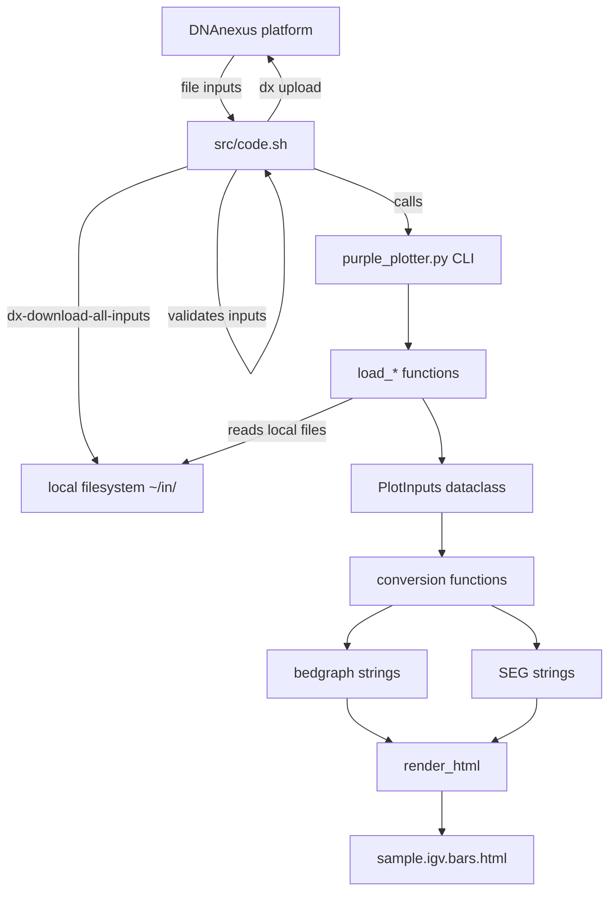

# DESIGN — eggd_purple_plotter

## 1. Problem statement

The PURPLE/AMBER/CNVkit pipeline produces per-sample copy-number and allele-frequency
data as TSV files on DNAnexus. Reviewing these results currently requires either a
desktop IGV installation with manual track loading, or a separate script
(`igv_bars.py` in `cnv-backbone-purple-atlas`) that is coupled to project-specific
directory layouts and cohort configurations.

`eggd_purple_plotter` decouples the HTML generation from the data-fetching
infrastructure, turning it into a single-sample DNAnexus app that can be wired
directly into the existing per-sample workflow and rerun independently.

---

## 2. External system overview

### DNAnexus platform

- **Org**: `org-emee_1` / **Region**: `aws:eu-central-1`
- **App pattern**: Bash entry point (`code.sh`) + pure Python CLI (`purple_plotter.py`)
- `dx-download-all-inputs --parallel` downloads all `inputSpec` files to `~/in/<param>/`
- `dx-jobutil-add-output <name> <id> --class=file` registers the output
- Ubuntu 24.04 workers enforce PEP 668 — always use a venv for pip installs

### igv.js 3.8.3

- Loaded from CDN at view time: `https://igv.org/web/release/3.8.3/dist/igv.min.js`
- Data embedded as JavaScript blob URLs (`URL.createObjectURL(new Blob([text]))`)
- Mounts inside a shadow DOM on the container element (relevant for Playwright testing)
- Track types used: `wig` (bedgraph, scatter/bar), `seg`, `merged`
- `GradientColorScale` API (3.8.3+): uses `lowColor`/`highColor` CSS strings —
  the old `lowR/lowG/lowB` fields from 3.0.2 are broken in 3.8.3

---

## 3. Architecture



---

## 4. Module responsibilities

### 4.1 `src/code.sh`

**Responsibilities:**
- Validate that at least one of `purple_tar` or `cnvkit_cnr` is present; exit 1 with a clear message if not
- Download all inputs via `dx-download-all-inputs --parallel`
- Create and activate a Python venv; install bundled wheels
- Build the CLI argument string, appending flags only for inputs that were supplied
- Call `purple_plotter.py`
- Upload the output HTML and register it with `dx-jobutil-add-output`

**Must NOT:**
- Contain any data-conversion or HTML-generation logic
- Import or call dxpy directly (all DNAnexus I/O via dx CLI)
- Use `set -u` (leaks into the DNAnexus job wrapper and breaks output upload)

**Validation logic (ordered steps):**
1. Check `[ -z "$purple_tar" ] && [ -z "$cnvkit_cnr" ]` — if both empty, print error to stderr and `exit 1`
2. Call `dx-download-all-inputs --parallel`
3. Create venv at `/tmp/ppenv`; install `/home/dnanexus/packages/*`
4. Build `$args` string; append `--purple_tar` only if `$purple_tar` is set, same for all optional inputs
5. Call `/tmp/ppenv/bin/python3 /home/dnanexus/purple_plotter/purple_plotter.py $args`
6. Upload `~/${sample_id}.igv.bars.html`; register as `igv_html` output

---

### 4.2 `resources/home/dnanexus/purple_plotter/purple_plotter.py`

**Responsibilities:**
- Parse CLI arguments (argparse)
- Load each input file from the local filesystem via `load_*` functions
- Convert dataframes to bedgraph/SEG strings via conversion functions
- Render and write the self-contained HTML file
- Degrade gracefully: missing optional inputs produce `?` header values or omit tracks

**Must NOT:**
- Import `dxpy` or call `dx` CLI
- Make any network requests
- Access any path outside the arguments passed on the CLI

**Public interface:**

```python
# ── Data loading ──────────────────────────────────────────────────────────────

def load_purple_data(purple_tar: Path, sample_id: str) -> PurpleData:
    """Extract amber.baf.tsv, target_region_cn.tsv, purple.segment.tsv from tar.gz."""
    ...

def load_qc_data(qc_report: Path) -> QCData:
    """Parse purity, ploidy, status from qc_report.tsv. Returns defaults on missing file."""
    ...

def load_msi_data(msi_report: Path | None) -> MSIData:
    """Parse msi_score from msi.tsv. Returns ('?', '?') if path is None."""
    ...

def load_cnvkit_data(
    cnr: Path | None, call_cns: Path | None, genemetrics: Path | None
) -> CNVkitData:
    """Load CNVkit files. Any absent path → None DataFrame in returned dataclass."""
    ...

# ── Data conversion ───────────────────────────────────────────────────────────

def coverage_log2_bedgraph(cn_df: pd.DataFrame) -> str: ...
def cn_bars_by_state(seg_df: pd.DataFrame, ploidy: float) -> dict[str, str]: ...
def baf_bedgraph(baf_df: pd.DataFrame) -> str: ...
def baf_bedgraph_mirror(baf_df: pd.DataFrame) -> str: ...
def baf_seg_bars_by_state(seg_df: pd.DataFrame, ploidy: float) -> dict[str, str]: ...
def to_seg(seg_df: pd.DataFrame, sample: str, ploidy: float) -> str: ...
def cnr_to_bedgraph(cnr_df: pd.DataFrame) -> str: ...
def cns_to_seg(cns_df: pd.DataFrame, sample: str, ploidy: float) -> str: ...
def genemetrics_to_bedgraph(gm_df: pd.DataFrame) -> str: ...

# ── Rendering ─────────────────────────────────────────────────────────────────

def render_html(plot_inputs: PlotInputs) -> str:
    """Fill HTML_BARS template; returns complete HTML string."""
    ...

def main() -> None:
    """CLI entry point."""
    ...
```

---

## 5. Data model

```python
from dataclasses import dataclass, field
import pandas as pd
from pathlib import Path

@dataclass
class PurpleData:
    baf_df: pd.DataFrame   # columns: chromosome, position, tumorBAF
    cn_df:  pd.DataFrame   # columns: chromosome, windowStart, windowEnd,
                           #          windowTumorRatio, masked
    seg_df: pd.DataFrame   # columns: chromosome, start, end,
                           #          tumorCopyNumber, tumorBAF

@dataclass
class QCData:
    purity: float  = 0.5       # fraction (0–1)
    ploidy: float  = 2.0       # average ploidy
    status: str    = "UNKNOWN" # e.g. "NORMAL", "FAIL_CONTAMINATION"

@dataclass
class MSIData:
    score_str:  str = "?"   # e.g. "3.42%"
    status_str: str = "?"   # "MSI-H" or "MSS"

@dataclass
class CNVkitData:
    cnr_df: pd.DataFrame | None = None  # columns: chromosome, start, end, log2
    cns_df: pd.DataFrame | None = None  # columns: chromosome, start, end, log2, cn, probes
    gm_df:  pd.DataFrame | None = None  # columns: chromosome, start, end, log2

@dataclass
class PlotInputs:
    sample_id:   str
    locus:       str         = "all"
    purple:      PurpleData | None  = None
    qc:          QCData             = field(default_factory=QCData)
    msi:         MSIData            = field(default_factory=MSIData)
    cnvkit:      CNVkitData         = field(default_factory=CNVkitData)
```

**CN state thresholds** (log₂(CN/ploidy) space):

| State | lo | hi | Colour |
|---|---|---|---|
| `hodel` | −∞ | −1.0 | `#8b0000` |
| `loss` | −1.0 | −0.3 | `#fca5a5` |
| `diploid` | −0.3 | +0.3 | `#4d4d4d` |
| `gain` | +0.3 | +1.0 | `#93c4e0` |
| `amp` | +1.0 | +∞ | `#08306b` |

---

## 6. Error handling strategy

| Situation | Behaviour | Raised by |
|---|---|---|
| Neither `purple_tar` nor `cnvkit_cnr` provided | `code.sh` exits 1 before calling Python | `code.sh` |
| Tar archive missing expected file | `RuntimeError` with clear message (file suffix + sample) | `load_purple_data` |
| TSV missing expected column | `KeyError` propagates; job fails with traceback | conversion functions |
| Optional file path is `None` | Function returns empty string `""` or `None` dataframe; track omitted | `load_*` functions |
| `windowTumorRatio ≤ 0.05` | Row skipped silently (noisy low-coverage region) | `coverage_log2_bedgraph` |
| `tumorCopyNumber ≤ 0` | Row skipped silently (uncallable region) | `cn_bars_by_state`, `to_seg` |
| Non-finite log₂ value in CNVkit data | Row skipped silently | `cnr_to_bedgraph`, `cns_to_seg`, `genemetrics_to_bedgraph` |
| `msi_score` below threshold (8.0%) | Status set to `MSS`; not an error | `load_msi_data` |

---

## 7. Testing strategy

Tests live in `tests/` and use `pytest`. The Python module has no dxpy dependency —
all tests run locally with fixture TSV files.

**Red/Green TDD order:**

1. Write the test with fixture data → verify it fails (import error or assertion).
2. Implement the minimum code to make it pass.
3. Run `pytest tests/ -v` — all green before moving to next milestone.

**Mock requirements:**

| Test module | What to mock |
|---|---|
| `test_data_loading.py` | None — reads real fixture files from `tests/test_data/` |
| `test_conversion.py` | None — pure DataFrame → string transformations |
| `test_render.py` | None — writes to `tmp_path` (pytest fixture) |

**Acceptance criteria for v1.0.0:**

- [ ] `pytest tests/ -v` passes with 0 failures
- [ ] HTML output contains `sample_id` string in title and header
- [ ] HTML output contains `igv.org` CDN script tag
- [ ] When `purple_tar` absent: no PURPLE tracks in HTML (bedgraph strings are empty)
- [ ] When `qc_report` absent: header shows purity `?` and ploidy `?`
- [ ] When `cnvkit_*` absent: no CNVkit tracks in HTML
- [ ] When `msi_report` absent: header shows MSI `?`
- [ ] `code.sh` exits 1 when neither `purple_tar` nor `cnvkit_cnr` is set (tested via bats or bash -c)
- [ ] HTML file is a valid HTML document (`<!DOCTYPE html>` present, balanced `<html>` tag)

---

## 8. Limitations

1. igv.js is loaded from CDN at view time — the HTML will not render without internet access.
2. Large cohorts (>10,000 AMBER BAF sites per chromosome) produce HTML files >10 MB; this is expected and accepted.
3. Chromosome naming is hard-coded to `chr1`–`chr22`, `chrX` — samples with non-prefixed chromosomes will produce empty tracks silently.
4. The igv.js shadow DOM means Playwright testing must use `shadowRoot` queries — standard `document.querySelectorAll` will not find canvases.
5. The app does not validate that the supplied files belong to the same sample — mismatched inputs will produce a rendered but misleading HTML without error.
6. No CI platform testing — `pytest` tests are local only; DNAnexus platform tests require manual execution.

---

## 9. Use cases

1. **Primary**: A clinical bioinformatician submits a PURPLE workflow run; `eggd_purple_plotter` runs as the final stage and produces an IGV bars HTML for immediate review.
2. **Secondary**: A bioinformatician reruns the plotter stage alone after PURPLE reports a purity change, without rerunning the full workflow.
3. **Secondary**: The app is run with only CNVkit inputs (no PURPLE tar) for a sample where PURPLE did not converge.
4. **Non-use-case**: Running on a cohort in batch — use a submission script calling the app per-sample in parallel instead.

---

## 10. Open design questions

1. **Should `purple_tar` and `qc_report` be separate inputs, or should the qc_report be extracted from the tar?**
   *Decision for v1.0.0*: Keep as separate inputs. The tar already exists from the pipeline; the QC report is a small separate file used by other downstream steps. Merging them would require changing upstream pipeline outputs.

2. **Should the igv.js library be bundled offline (in `resources/`) rather than loaded from CDN?**
   *Decision for v1.0.0*: CDN load only. The HTML is intended for viewing by staff on hospital networks with internet access. Bundling igv.min.js (~1 MB) into every HTML file would roughly double file size and complicate the build.

3. **Should the app support producing a cohort index page?**
   *Decision for v1.0.0*: No. A separate lightweight app or script is the right place for this (see `eggd_purple_plotter_plan.md` in `cnv-backbone-purple-atlas` repo).
